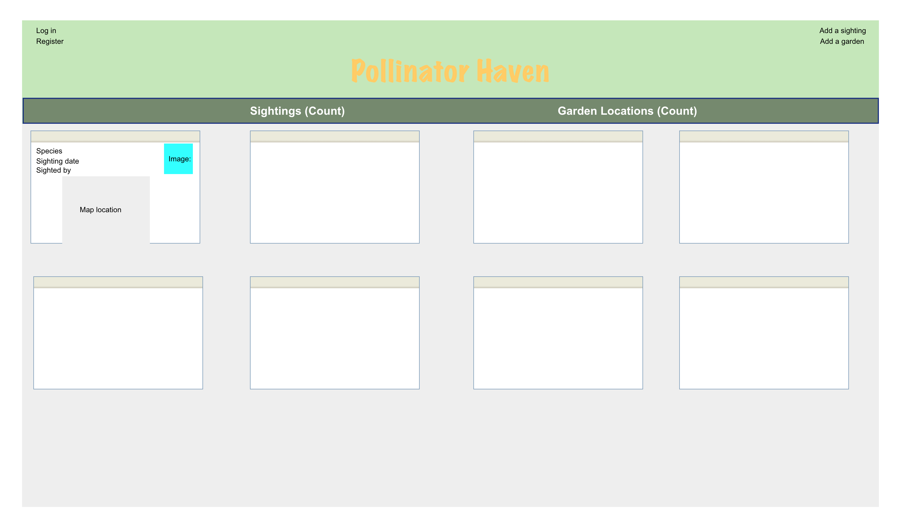
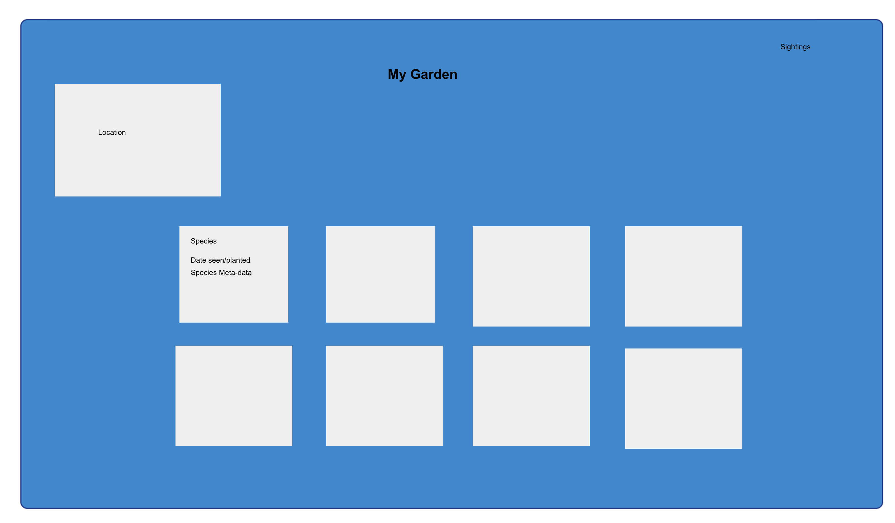

# pollinator_haven
====
A full CRUD app built for Citizen Scientists for viewing and cataloging existing pollinator gardens in a local area. Complete with community and educational resources.

[Project Trello Board](https://trello.com/invite/b/GfFsJfUd/de7a97b7975b3a2a5402b3b51c150e28/pollinator-haven)

## SHORT GOAL

- Home Page can show species sightings/observations or locations of pollinator gardens or plants.
- Give user access to add plants and pollinators to their own GARDEN page.
  - Complete with meta data.
- Allow users to add their garden to garden INDEX/HOME page.

Will require two models. Gardens and garden contents

## LONG GOAL

- Give user access to education resources on pollinators and pollinator plants for their region.
- ADD Google maps API to plot locations of gardens and species sightings.
- Allow users to add photos from their phone.

### WIREFRAMES

### Local Device Dependency Installations:
1. `npm init`
2. `npm i express`
3. `npm i ejs`
4. `npm i method-override`
5. `npm i mongoose`
6. `npm i express-session`
7. `npm i bcrypt`
